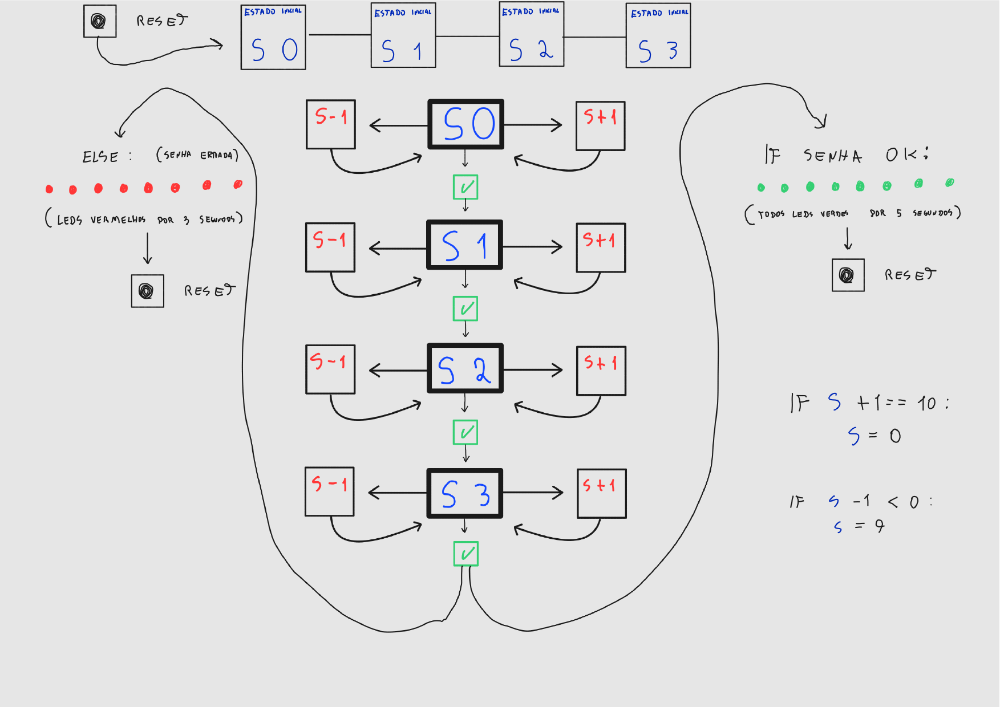
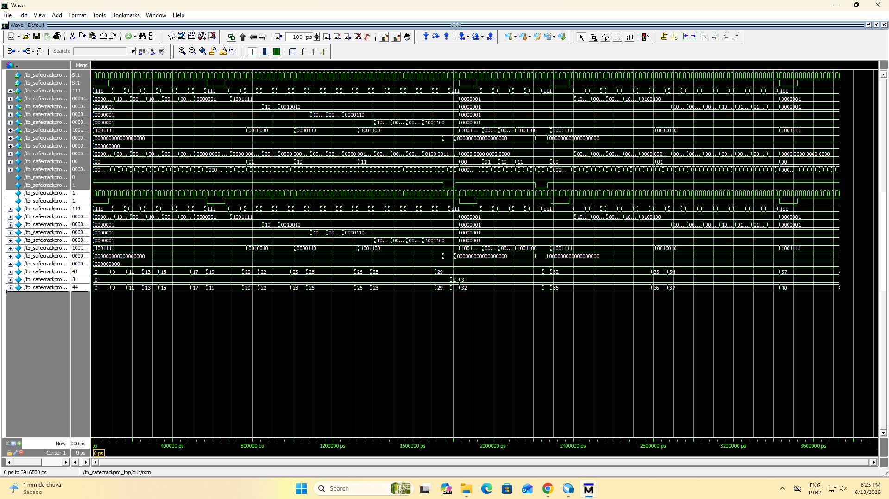

# SafeCrackPro — Cofre Digital com FSM (Sistemas Digitais)

Projeto da disciplina de **Sistemas Digitais** (CIn) implementado em **SystemVerilog** para a placa **Terasic DE2-115** (FPGA Cyclone IV).

O projeto evolui a FSM *SafeCrack* apresentada em sala: em vez de digitar a senha diretamente, o usuário **compõe cada dígito navegando de 0 a 9** com os push buttons, confirmando dígito a dígito até tentar abrir o cofre.

---

## Objetivo

Implementar a fechadura de um cofre cuja senha tem **quatro dígitos** (cada um de `0` a `9`). O usuário monta a senha **um dígito por vez**:

1. Ajusta o valor do **dígito ativo** incrementando/decrementando (com *wrap-around* 0↔9).
2. **Confirma** o dígito, o que avança para o próximo.
3. Ao confirmar o **quarto** dígito, o sistema tenta abrir o cofre, comparando a senha digitada com a senha correta definida no código.
4. O resultado é sinalizado por LEDs (verdes = sucesso, vermelhos = falha) e o sistema retorna sozinho ao estado inicial.

A navegação entre dígitos é **sempre para frente**: não há retorno a um dígito já confirmado. Para recomeçar, usa-se o **reset**.

---

## Diagrama de estados



Leitura do diagrama:

- **`S0`, `S1`, `S2`, `S3`** — índice do dígito ativo (1º ao 4º dígito). Após reset, o sistema parte de `S0` com todos os displays em `0`.
- **`S+1` / `S-1`** — incrementa / decrementa o **valor** do dígito ativo, com *wrap-around*:
  - `IF S+1 == 10: S = 0` (passou de 9 → volta a 0)
  - `IF S-1 < 0: S = 9` (passou de 0 → volta a 9)
- **✓ (seta verde)** — confirma o dígito atual e avança para o próximo índice.
- **`IF SENHA OK`** — ao confirmar o último dígito com a senha correta: **todos os LEDs verdes** acendem por **5 segundos**, depois o sistema reseta.
- **`ELSE` (senha errada)** — **LEDs vermelhos** acendem por **3 segundos**, depois o sistema reseta.
- **`RESET`** — de qualquer estado, retorna ao estado inicial (`S0`, displays em `0`, LEDs apagados).

---

## Arquitetura

O projeto é dividido em três módulos:

| Arquivo | Módulo | Responsabilidade |
|---|---|---|
| `safecrackpro_top.sv` | `safecrackpro_top` | Top-level: instancia a FSM e os decodificadores de display; gera o sinal de *blink*. |
| `safecrackpro_fsm.sv` | `safecrackpro_fsm` | Núcleo da lógica: detecção de borda dos botões, máquina de estados, edição dos dígitos, verificação da senha e temporização dos LEDs. |
| `bcd_to_7segment_anodo.sv` | `bcd_to_7segment_anodo` | Decodificador BCD → 7 segmentos (ânodo comum, ativo em `0`). |

A simulação é feita por `tb_safecrackpro_top.sv`.

---

## Como os requisitos foram implementados

### 1. Composição da senha dígito a dígito

Os quatro dígitos são armazenados no vetor empacotado `digits[3:0][3:0]` (quatro valores BCD de 4 bits). O sinal `current_position_idx` (0–3) indica qual dígito está em edição.

No estado **`CURRENT_POSITION`**, apenas o dígito apontado por `current_position_idx` é alterado:

```systemverilog
if (btn_edge[1]) begin               // incrementa o dígito ativo
    if (digits[idx] == 9) digits[idx] = 0;   // wrap-around 9 → 0
    else                  digits[idx] = digits[idx] + 1;
end
else if (btn_edge[2]) begin          // decrementa o dígito ativo
    if (digits[idx] == 0) digits[idx] = 9;   // wrap-around 0 → 9
    else                  digits[idx] = digits[idx] - 1;
end
else if (btn_edge[0]) begin          // confirma / avança
    if (current_position_idx == 3) next_state = CHECK_PASSWORD;
    else                           next_position = current_position_idx + 1;
end
```

A independência entre posições (editar um dígito não afeta os demais) é garantida pela indexação por `current_position_idx` e validada nos testes do testbench.

### 2. Uma ação por pressionamento (detecção de borda)

Os botões da DE2-115 são **ativos em nível baixo**. A FSM inverte o sinal (`btn_pos = ~btn`) e usa um **detector de borda de subida** para que segurar o botão gere **apenas uma** ação:

```systemverilog
assign btn_pos  = ~btn;
assign btn_edge =  btn_pos & ~btn_prev;   // 1 só no ciclo da borda
```

### 3. Verificação e feedback

A senha correta (**5-6-7-3**) é definida como um `parameter` do módulo, podendo ser alterada sem mexer na lógica:

```systemverilog
module safecrackpro_fsm #(
    // Senha correta do cofre (dígitos 5-6-7-3), empacotada como [3:0][3:0].
    parameter logic [3:0][3:0] PASSWORD = {4'd3, 4'd7, 4'd6, 4'd5}
) ( ... );
```

No estado **`CHECK_PASSWORD`**, os quatro dígitos são comparados com esse parâmetro:

```systemverilog
if (digits == PASSWORD)
    next_state = WAIT_GREEN_LED_TIME;   // sucesso
else
    next_state = WAIT_RED_LED_TIME;     // falha
```

- **Sucesso:** `led_green = 9'h1FF` (9 LEDs verdes) mantidos por **5 s**.
- **Falha:** `led_red = 18'h3FFFF` (18 LEDs vermelhos) mantidos por **3 s**.

A temporização usa um contador decrescente carregado com constantes calibradas para o clock de **50 MHz**:

```systemverilog
localparam int TIME_3S = 150_000_000;   // 3 s  @ 50 MHz
localparam int TIME_5S = 250_000_000;   // 5 s  @ 50 MHz
```

Ao expirar o tempo, a FSM volta para `START`, que zera os dígitos e o índice — retornando automaticamente ao estado inicial.

### 4. Indicação do dígito ativo

Um display adicional (`seg_cur_pos`, mapeável em **HEX4**) mostra o índice do dígito em edição. O índice interno (0–3) é exibido como **1–4** para o usuário:

```systemverilog
bcd_to_7segment_anodo dec_cur_pos (
    .bcd ({2'b00, position} + 4'd1),   // 0→"1", 1→"2", 2→"3", 3→"4"
    .seg (seg_cur_pos)
);
```

---

## Mapeamento de hardware

### Push buttons

A FSM usa o barramento `btn[2:0]` (ativo em nível baixo) mais o reset assíncrono `rstn`:

| Sinal | Função |
|---|---|
| `btn[1]` | Incrementa o dígito ativo (→) |
| `btn[2]` | Decrementa o dígito ativo (←) |
| `btn[0]` | Confirma o dígito / avança (e dispara a verificação no 4º dígito) |
| `rstn`   | Reset assíncrono — volta ao estado inicial |

### Displays de 7 segmentos

| Saída | Conteúdo | DE2-115 |
|---|---|---|
| `seg_pos4` | Dígito 3 (mais significativo) | HEX3 |
| `seg_pos3` | Dígito 2 | HEX2 |
| `seg_pos2` | Dígito 1 | HEX1 |
| `seg_pos1` | Dígito 0 (menos significativo) | HEX0 |
| `seg_cur_pos` | Índice do dígito ativo (1–4) | HEX4 |

Os displays são de **ânodo comum** (segmento aceso = `0`), conforme `bcd_to_7segment_anodo.sv`.

### LEDs

| Saída | Largura | Uso |
|---|---|---|
| `led_green` | 9 bits (LEDG) | Acende quando a senha está **correta** |
| `led_red`   | 18 bits (LEDR) | Acende quando a senha está **incorreta** |

---

## Estados da FSM

| Estado | Descrição |
|---|---|
| `START` | Zera dígitos, índice e contadores; transita para `CURRENT_POSITION`. |
| `CURRENT_POSITION` | Estado de edição/navegação: incrementa, decrementa ou confirma o dígito ativo. |
| `CHECK_PASSWORD` | Compara a senha digitada com a senha correta e escolhe o caminho de feedback. |
| `WAIT_GREEN_LED_TIME` | Mantém LEDs verdes por 5 s; ao fim, volta para `START`. |
| `WAIT_RED_LED_TIME` | Mantém LEDs vermelhos por 3 s; ao fim, volta para `START`. |

---

## Simulação

O testbench `tb_safecrackpro_top.sv` (auto-verificável, formato PASS/FAIL) cobre:

1. Reset e valores iniciais (dígitos em 0, índice 0, displays e LEDs corretos).
2. Incremento de dígito (`btn[1]`).
3. Decremento de dígito (`btn[2]`).
4. *Wrap-around* no decremento (0 → 9).
5. *Wrap-around* no incremento (9 → 0).
6. Senha correta → LEDs verdes → reset automático.
7. Senha incorreta → LEDs vermelhos → reset automático.
8. Independência dos dígitos por posição.
9. Estabilidade do estado sem botão pressionado.

Para evitar simular os 5×10⁸/1,5×10⁸ ciclos das esperas de LED, o testbench usa `force`/`release` sobre `led_time_cnt`, pulando a contagem de 3 s/5 s.

### Diagrama de tempo (waveforms)



---

## Estrutura de arquivos

```
.
├── README.md                     # esta documentação
├── safecrackpro_top.sv           # top-level
├── safecrackpro_fsm.sv           # máquina de estados (núcleo)
├── bcd_to_7segment_anodo.sv      # decodificador 7 segmentos
├── tb_safecrackpro_top.sv        # testbench
├── waveforms.png                 # diagrama de tempo da simulação
└── docs/
    └── maquina_de_estados.png    # diagrama de estados (imagem do README)
```
